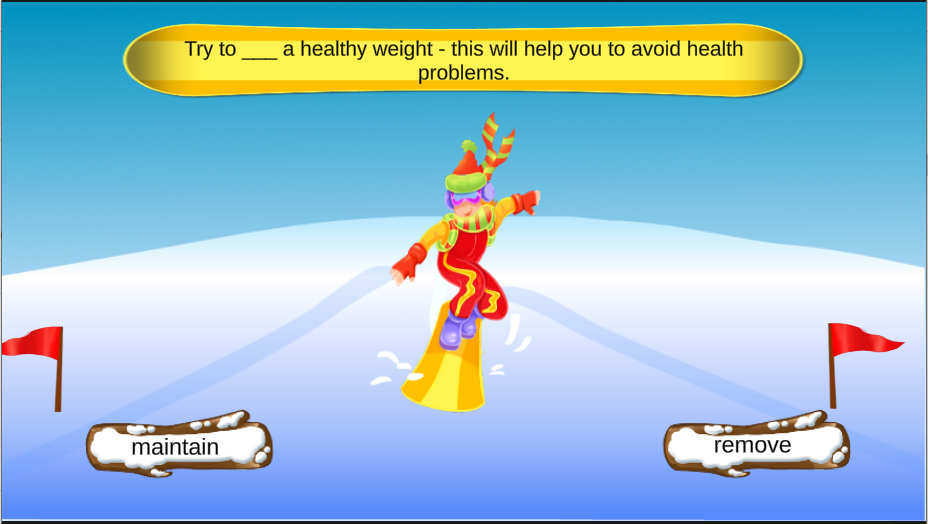

# Language-Exercise-3
This project is an e-learning exercise written in Unity. The exercise will help students to learn new vocabulary. The language that will be used is english. 

## Requirements
- Multiple choice exercise
- Sentences will appear on the screen with a word missing
- Two choices will be given two the student to find the correct word
- Animation must be used to reenforce positive or negative feedbag

## Gallery

